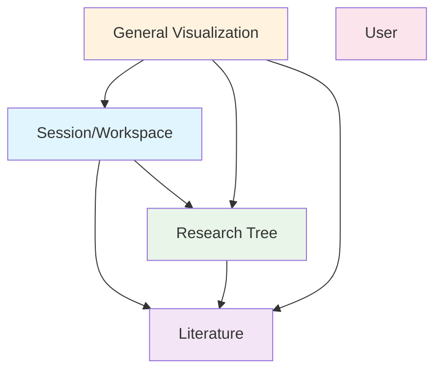

# 🏗️ Research Navigator 架构重构总结

> **重构版本**: v2.0  
> **完成日期**: 2025-01-19  
> **状态**: ✅ 核心领域架构完成

## 📋 重构概述

本次重构将原有的技术驱动架构转换为**领域驱动设计(DDD)**架构，按照业务领域重新组织代码，建立清晰的依赖关系和数据流。

---

## 🎯 重构目标

### ✅ 已完成目标

1. **避免"万能抽屉"问题**：不再按技术类型分组，而是按业务领域分组
2. **建立清晰的依赖关系**：单向依赖流，避免循环依赖
3. **数据层设计**：Dexie(持久化) + Zustand(内存状态) 组合
4. **业务边界明确**：每个领域职责清晰，高内聚低耦合

---

## 🏗️ 新架构结构

```
src/features/
├── 📚 literature/                 # 文献领域
│   ├── data-access/               # 数据访问层 (Dexie + Zustand)
│   │   ├── literature-types.ts   # 类型定义
│   │   ├── literature-store.ts   # Zustand状态管理
│   │   ├── literature-repository.ts # Dexie数据仓库
│   │   └── index.ts              # 导出
│   ├── management/                # 文献管理功能
│   ├── details/                   # 文献详情功能
│   ├── visualization/             # 文献相关可视化
│   └── index.ts                  # 领域主导出
│
├── 🌳 research-tree/              # 研究树领域
│   ├── data-access/               # 数据访问层
│   │   ├── research-tree-types.ts # 类型定义
│   │   ├── research-tree-store.ts # Zustand状态管理
│   │   ├── research-tree-repository.ts # Dexie数据仓库
│   │   └── index.ts              # 导出
│   ├── tree-management/           # 树结构管理
│   ├── mcts-engine/               # MCTS算法引擎
│   ├── visualization/             # 树相关可视化
│   └── index.ts                  # 领域主导出
│
├── 💬 session/                    # 会话/工作区领域
│   ├── core/                      # 会话管理核心
│   │   ├── session-types.ts      # 类型定义
│   │   ├── session-store.ts      # Zustand状态管理
│   │   ├── session-repository.ts # Dexie数据仓库(待实现)
│   │   └── index.ts              # 导出
│   ├── layout/                    # 布局组件(从原layout移入)
│   │   ├── MainLayout.tsx        # 主布局
│   │   ├── Header.tsx            # 头部组件
│   │   └── Sidebar.tsx           # 侧边栏组件
│   ├── integrations/              # 集成其他领域
│   │   ├── literature-in-session/ # 会话中的文献集成
│   │   └── research-in-session/   # 会话中的研究集成
│   └── index.ts                  # 领域主导出
│
├── 🎨 visualization/              # 通用可视化领域
│   ├── charts/                    # 通用图表
│   ├── analytics/                 # 分析功能
│   ├── reports/                   # 报告生成
│   └── index.ts                  # 领域主导出(待实现)
│
├── 👤 user/                       # 用户领域
│   ├── auth/                      # 认证
│   ├── profile/                   # 个人资料
│   ├── settings/                  # 设置
│   └── index.ts                  # 领域主导出(待实现)
│
└── index.ts                      # 所有领域统一导出
```

---

## 🔄 依赖关系图



**关键依赖原则**：
- ✅ **Session → Literature + Research Tree**：会话聚合两者
- ✅ **Research Tree → Literature**：树节点引用文献ID
- ✅ **Literature ↔ Research Tree**：不直接耦合，通过引用连接
- ✅ **Visualization → All**：可视化可依赖所有领域来展示数据

---

## 💾 数据层设计

### 技术选型
- **Dexie (IndexedDB)**：持久化存储，支持复杂查询和索引
- **Zustand**：内存状态管理，响应式UI更新
- **引用关系**：Research Tree节点存储Literature的ID，而非完整对象

### 数据流
```
UI Components
     ↕
Zustand Stores (内存状态)
     ↕
Repository Layer (Dexie)
     ↕
IndexedDB (持久化)
```

---

## 📊 核心实体模型

### Literature Domain
- `LiteratureItem`: 文献条目
- `LiteratureCollection`: 文献集合
- `CitationRelation`: 引用关系
- `LiteratureNote`: 文献笔记

### Research Tree Domain  
- `ResearchTree`: 研究树
- `ResearchTreeNode`: 树节点(引用Literature ID)
- `MCTSIteration`: MCTS迭代记录
- `ResearchExpansion`: 节点扩展记录

### Session Domain
- `ResearchSession`: 研究会话
- `DialogueMessage`: 对话消息
- `SessionPreferences`: 会话偏好设置
- `ResearchPhase`: 研究阶段

---

## 🎯 使用方式

### 导入方式
```typescript
// 方式1: 导入特定领域
import { useLiteratureStore, LiteratureItem } from '@/features/literature';
import { useResearchTreeStore, ResearchTreeNode } from '@/features/research-tree';
import { useSessionStore, ResearchSession } from '@/features/session';

// 方式2: 导入所有领域
import { Literature, ResearchTree, Session } from '@/features';

// 使用
const literatureStore = Literature.useLiteratureStore();
const treeStore = ResearchTree.useResearchTreeStore();
const sessionStore = Session.useSessionStore();
```

### 数据访问
```typescript
// Literature操作
const literature = useLiteratureStore();
await literatureRepository.addLiterature(newItem);
literature.addItem(newItem);

// Research Tree操作  
const tree = useResearchTreeStore();
await researchTreeRepository.addNode(newNode);
tree.addNode(newNode);

// Session操作
const session = useSessionStore();
session.createSession({ title: '新研究', initialQuestion: '问题' });
```

---

## 🚀 下一步计划

### 待实现功能
- [ ] **Visualization领域**：通用图表和分析功能
- [ ] **User领域**：用户认证和设置
- [ ] **MCTS Engine**：算法引擎实现
- [ ] **Integration Layers**：会话中的领域集成
- [ ] **Management Layers**：各领域的管理功能

### 优化方向
- [ ] **性能优化**：大数据量下的查询优化
- [ ] **缓存策略**：智能缓存和预加载
- [ ] **错误处理**：统一错误处理机制
- [ ] **类型安全**：更严格的TypeScript类型

---

## 📝 重构收益

### ✅ 已获得收益
1. **清晰的业务边界**：每个领域职责明确
2. **可维护性提升**：代码按业务逻辑组织，易于理解和修改
3. **可扩展性增强**：新功能可以独立在对应领域中开发
4. **依赖关系清晰**：避免了循环依赖和"万能抽屉"问题
5. **数据一致性**：统一的数据访问层和状态管理

### 🎯 预期收益
1. **开发效率**：新功能开发更快，bug更少
2. **团队协作**：不同开发者可以专注不同领域
3. **测试友好**：每个领域可以独立测试
4. **性能优化**：精确的数据加载和缓存策略

---

## 🔍 关键设计决策

### 1. 为什么选择DDD架构？
- **业务复杂度**：Research Navigator有复杂的业务逻辑
- **长期维护**：按业务领域组织更易于长期维护
- **团队规模**：适合多人协作开发

### 2. 为什么选择Dexie + Zustand？
- **数据量大**：文献和树节点数据量大，需要持久化
- **复杂查询**：需要按标签、时间、关系查询
- **响应式UI**：Zustand提供良好的响应式状态管理

### 3. 为什么使用引用而非复制？
- **数据一致性**：避免数据不同步问题
- **存储效率**：减少重复数据存储
- **关系维护**：更容易维护实体间关系

---

这个架构为Research Navigator奠定了坚实的基础，支持未来的功能扩展和性能优化。
