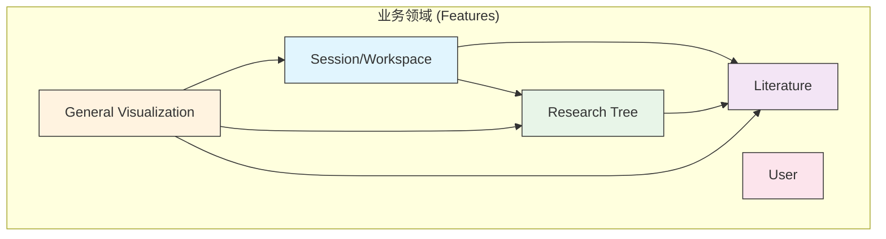

# 🏗️ Research Navigator 架构文档

> **版本**: v2.0
> **状态**: ✅ 核心架构定义完成

## 📋 概述

本文档定义了 Research Navigator v2.0 的核心软件架构。该架构采用**领域驱动设计 (DDD)** 和**垂直切片 (Vertical Slices)** 的思想，将代码按业务领域而非技术类型进行组织，旨在建立一个高内聚、低耦合、可扩展、易于维护的代码库。

---

## 🏗️ 应用架构依赖规则 (The Onion Architecture)

我们的应用遵循严格的**单向依赖原则**，可以想象成一个四层同心圆（洋葱）结构。依赖关系只能从外层指向内层，内层绝不能知道外层的存在。

```
          ┌───────────────────────────────────────────────────┐
          │  Layer 4: app/ (路由与页面组装层)                     │
          │      依赖于 ↓                                       │
          ├───────────────────────────────────────────────────┤
          │  Layer 3: components/ (通用UI与布局层)                │
          │      依赖于 ↓                                       │
          ├───────────────────────────────────────────────────┤
          │  Layer 2: features/ (业务领域核心层)                  │
          │      依赖于 ↓                                       │
          ├───────────────────────────────────────────────────┤
          │  Layer 1: lib/ (基础设施与核心模型层)                 │
          └───────────────────────────────────────────────────┘
```

*   **依赖规则**: **外层可以依赖内层，内层绝不能依赖外层。**
    *   ✅ **允许**: `app/` 导入 `features/` 和 `components/`。
    *   ✅ **允许**: `features/` 导入 `lib/`。
    *   🚫 **禁止**: `lib/` 导入 `features/`。
    *   🚫 **禁止**: `features/` 之间互相导入（除非通过明确的集成层，如 `session` 领域）。
*   **特殊层**: `providers/` 目录是一个特殊的存在，它为整个应用提供顶层上下文，通常在最外层的 `app/layout.tsx` 中使用。

---

## 📂 文件结构详解 (Directory Breakdown)

#### `app/` - 路由与页面组装层 (The "What")
*   **核心职责**: 定义应用的 URL 路由结构，并将来自 `features` 和 `components` 的模块组装成用户可见的页面。
*   **包含内容**: Next.js App Router 的保留文件，如 `page.tsx`, `layout.tsx`, `loading.tsx`。
*   **关键原则**: **保持页面“薄”**。此目录下的文件应专注于布局和组装，避免包含复杂的业务逻辑。例如，`app/literature/library/page.tsx` 会导入并渲染来自 `features/literature/management` 的组件。

#### `features/` - 业务领域核心层 (The "How")
*   **核心职责**: 实现应用所有的核心业务功能。这是应用的“心脏和大脑”，每个子目录代表一个独立的业务领域。
*   **包含内容**:
    *   **领域文件夹 (e.g., `literature/`, `research-tree/`)**: 代表一个完整的业务功能。
    *   `data-access/`: **数据访问层**。封装了与数据源（API, Dexie）的交互和状态管理（Zustand）。这是取代传统全局 `services` 的现代模式。
        *   `*-types.ts`: 定义**仅此领域使用**的特定类型。
        *   `*-store.ts`: Zustand store，管理领域的内存状态，供 UI 响应式更新。
        *   `*-repository.ts`: 数据仓库，封装对 `lib/db` (Dexie) 的所有 CRUD 操作，是持久化逻辑的唯一入口。
    *   `management/`, `details/`, `visualization/`: **功能切片 (Slices)**。将一个大领域按具体用例进一步细分，每个切片包含其自身的组件和逻辑。
*   **关键原则**: **高内聚，低耦合**。一个领域应该可以被独立理解和开发，对其他领域的依赖降到最低。

#### `components/` - 通用UI与布局层 (The "Look")
*   **核心职责**: 提供全局可复用、**完全不含业务逻辑**的 UI 组件。
*   **包含内容**:
    *   `ui/`: **原子组件**。设计系统的基础，如 `Button.tsx`, `Input.tsx`, `Dialog.tsx`。它们是纯粹的展示组件（也称“哑”组件）。
    *   `layout/`: **结构性组件**。定义应用的整体页面结构，如 `PageWrapper.tsx`。注意：在你的新设计中，`Header` 和 `Sidebar` 已被移入 `features/session/layout`，这是一个非常好的决策，因为它们与“会话”这个业务领域紧密相关。
*   **关键原则**: **业务无关性**。这里的组件可以在任何地方使用，它们不知道自己将被用来显示“文献”还是“用户设置”。

#### `lib/` - 基础设施与核心模型层 (The "Foundation")
*   **核心职责**: 提供整个应用共享的、与具体业务功能无关的基础设施、工具和核心数据模型。
*   **包含内容**:
    *   `db/`, `api/`: 数据源的客户端实例配置（如 Dexie 实例, Axios 实例）。
    *   `types/`: **核心领域实体 (Entities)**。定义跨越多个 Feature 的核心数据结构，如 `User`, `Project`。
    *   `utils/`: 通用、纯粹的辅助函数库，如 `formatDate()`, `cn()`。
*   **关键原则**: **绝对稳定和独立**。`lib` 是应用的地基，它不能依赖任何其他上层目录 (`features`, `components`, `app`)。

#### `providers/` - 全局上下文层 (The "Context")
*   **核心职责**: 封装需要在应用根组件（`app/layout.tsx`）中使用的全局上下文提供者 (Context Providers)。
*   **包含内容**: `ThemeProvider`, `QueryClientProvider`, `SessionProvider` (NextAuth.js) 等。
*   **关键原则**: **注入全局能力**。将它们分离出来，使 `components` 目录的职责更纯粹，也清晰地表明了这些是应用的顶层配置。

---

## 🎯 核心领域结构 (`features/`)

```
src/features/
├── 📚 literature/                 # 文献领域
│   ├── data-access/               # 数据访问层 (Dexie + Zustand)
│   ├── management/                # 文献管理功能
│   └── ...
├── 🌳 research-tree/              # 研究树领域
│   ├── data-access/               # 数据访问层
│   ├── mcts-engine/               # MCTS算法引擎 (领域内核心逻辑)
│   └── ...
├── 💬 session/                    # 会话/工作区领域 (聚合器)
│   ├── core/                      # 会话管理核心 (数据与状态)
│   ├── layout/                    # 会话相关的布局组件 (Header, Sidebar)
│   ├── integrations/              # 集成其他领域，处理跨领域逻辑
│   └── ...
├── 🎨 visualization/              # 通用可视化领域
│   └── ...
├── 👤 user/                       # 用户领域
│   └── ...
└── index.ts                      # (可选) 导出所有领域，方便统一导入
```

---

## 🔄 依赖关系图



**关键依赖原则**:
- ✅ **Session → Literature + Research Tree**: 会话是组织和使用文献与研究树的工作空间。
- ✅ **Research Tree → Literature**: 研究树的节点可以引用一篇或多篇文献。
- ✅ **Literature 与 Research Tree 解耦**: 两者不直接互相依赖，通过ID引用建立松散联系，所有交互由上层（如Session）协调。
- ✅ **Visualization → All**: 可视化作为一个展示层，可以读取任何领域的数据并将其可视化。


---

## 💾 数据层设计

### 技术选型
- **Dexie (IndexedDB)**：持久化存储，支持复杂查询和索引
- **Zustand**：内存状态管理，响应式UI更新
- **引用关系**：Research Tree节点存储Literature的ID，而非完整对象

### 数据流
```
UI Components
     ↕
Zustand Stores (内存状态)
     ↕
Repository Layer (Dexie)
     ↕
IndexedDB (持久化)
```

---

## 📊 核心实体模型

### Literature Domain
- `LiteratureItem`: 文献条目
- `LiteratureCollection`: 文献集合
- `CitationRelation`: 引用关系
- `LiteratureNote`: 文献笔记

### Research Tree Domain  
- `ResearchTree`: 研究树
- `ResearchTreeNode`: 树节点(引用Literature ID)
- `MCTSIteration`: MCTS迭代记录
- `ResearchExpansion`: 节点扩展记录

### Session Domain
- `ResearchSession`: 研究会话
- `DialogueMessage`: 对话消息
- `SessionPreferences`: 会话偏好设置
- `ResearchPhase`: 研究阶段

---

## 🎯 使用方式

### 导入方式
```typescript
// 方式1: 导入特定领域
import { useLiteratureStore, LiteratureItem } from '@/features/literature';
import { useResearchTreeStore, ResearchTreeNode } from '@/features/research-tree';
import { useSessionStore, ResearchSession } from '@/features/session';

// 方式2: 导入所有领域
import { Literature, ResearchTree, Session } from '@/features';

// 使用
const literatureStore = Literature.useLiteratureStore();
const treeStore = ResearchTree.useResearchTreeStore();
const sessionStore = Session.useSessionStore();
```

### 数据访问
```typescript
// Literature操作
const literature = useLiteratureStore();
await literatureRepository.addLiterature(newItem);
literature.addItem(newItem);

// Research Tree操作  
const tree = useResearchTreeStore();
await researchTreeRepository.addNode(newNode);
tree.addNode(newNode);

// Session操作
const session = useSessionStore();
session.createSession({ title: '新研究', initialQuestion: '问题' });
```
