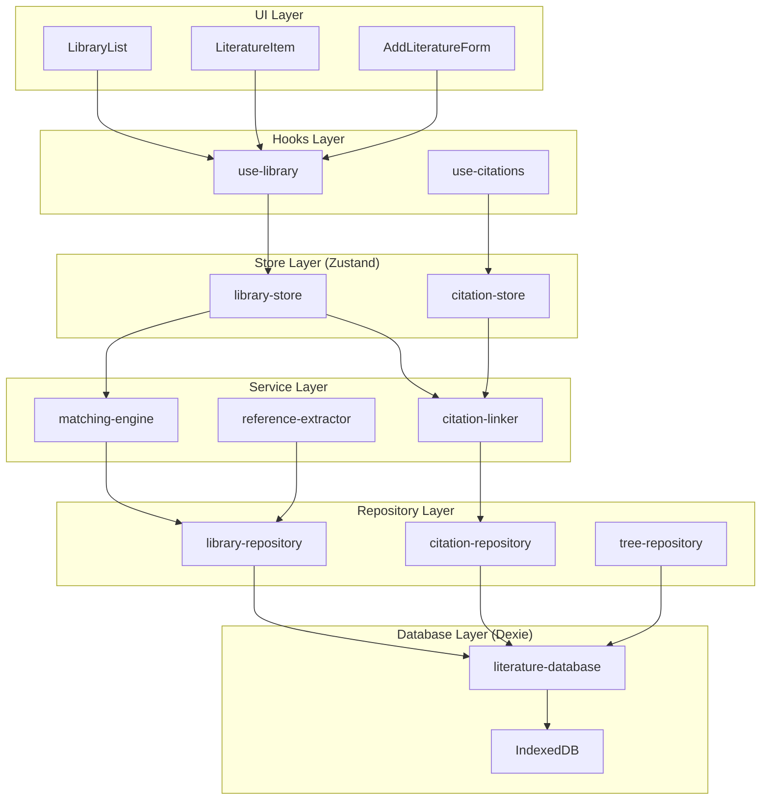

# 📚 文献管理系统底层架构深度分析与重构方案

> **文档版本**: v1.0  
> **创建日期**: 2025-01-30  
> **状态**: 🔄 架构分析完成，待重构实施

---

## 📋 目标概述

基于原有 `old/` 目录的文献管理系统，在新的 **Feature-First 架构** 下重新设计底层数据访问层，实现：

1. **功能完整性** - 保留所有核心功能
2. **架构现代化** - 迁移到领域驱动设计
3. **类型安全** - 完整TypeScript + Zod支持
4. **性能优化** - IndexedDB + Zustand最佳实践

---

## 🔍 原有架构深度分析

### 📊 核心架构特点

#### ✅ **架构优势**
1. **分层清晰** - UI → State → Service → Data 四层架构
2. **数据持久化** - 基于Dexie.js的IndexedDB方案
3. **类型安全** - Zod Schema + TypeScript全链路
4. **智能去重** - MatchingEngine智能查重机制
5. **引文管理** - CitationLinker自动引文链接
6. **版本迁移** - 完善的数据库版本升级机制

#### 📦 **核心模块结构**
```
old/src/libs/db/
├── schema.ts           # Zod数据模型 (LibraryItem, Citation, LiteratureTree)
├── index.ts            # Dexie数据库实例和版本管理
├── constants.ts        # 文献来源类型和元数据
├── LibraryService.ts   # 主要数据访问服务 (1000+ lines)
└── matching/           # 智能匹配模块
    ├── MatchingEngine.ts      # 智能查重引擎
    ├── CitationLinker.ts      # 引文链接器
    ├── ReferenceExtractor.ts  # 引用提取器
    └── SimilarityCalculator.ts # 相似度计算器
```

### 📋 核心数据模型

#### **LibraryItem (文献条目)**
```typescript
interface LibraryItem {
  id: string;                          // UUID主键
  title: string;                       // 标题
  authors: string[];                   // 作者列表
  year: number;                        // 发表年份
  source: LiteratureSource;            // 来源 (manual|search|import|knowledge|zotero)
  
  // 元数据
  publication?: string;                // 期刊/出版物
  abstract?: string;                   // 摘要
  summary?: string;                    // 用户总结
  doi?: string;                        // DOI
  url?: string;                        // URL
  pdfPath?: string;                    // PDF路径
  
  // 解析内容
  parsedContent?: {
    extractedText?: string;            // 提取文本
    extractedReferences?: any[];       // 解析引用
  };
  
  // 后端集成
  backendTask?: BackendTask;           // 后端任务状态
  
  // 元数据
  topics?: string[];                   // 主题标签
  associatedSessions?: string[];       // 关联会话
  createdAt: Date;
  updatedAt?: Date;
}
```

#### **LiteratureTree (文献树)**
```typescript
interface LiteratureTree {
  id: string;
  name: string;
  rootNodeId: string;
  nodes: Record<string, MCTSNode>;     // MCTS节点映射
  createdAt: Date;
}
```

#### **Citation (引文关系)**
```typescript
interface Citation {
  id?: number;                         // 自增ID
  sourceItemId: string;                // 源文献ID
  targetItemId: string;                // 目标文献ID
  createdAt: Date;
}
```

### 🛠️ 核心服务功能

#### **LibraryService 主要功能** (1000+ lines)
1. **基础CRUD** - 增删改查文献条目
2. **智能去重** - 基于URL/DOI/标题/作者的智能匹配
3. **数据合并** - 重复文献的智能合并策略
4. **搜索筛选** - 多字段全文搜索
5. **引文管理** - 自动/手动引文链接
6. **数据导入导出** - JSON格式批量操作
7. **统计分析** - 数据库统计信息
8. **主题管理** - Topics标签管理
9. **后端同步** - 与后端数据同步

#### **智能匹配系统**
- **MatchingEngine** - 基于多种策略的文献匹配
- **CitationLinker** - 自动引文关系建立
- **ReferenceExtractor** - 引用数据提取
- **SimilarityCalculator** - 文本相似度计算

---

## 🎯 新架构设计方案

### 📁 Feature-First 文件结构

基于领域驱动设计，将文献管理重构为独立的 **Literature** 领域：

```
src/features/literature/
├── data-access/                    # 数据访问层
│   ├── types/
│   │   ├── library-item.types.ts  # 文献条目类型
│   │   ├── citation.types.ts      # 引文关系类型
│   │   ├── literature-tree.types.ts # 文献树类型
│   │   └── index.ts
│   ├── database/
│   │   ├── literature-database.ts # Dexie数据库定义
│   │   ├── migration-manager.ts   # 版本迁移管理
│   │   └── index.ts
│   ├── repositories/
│   │   ├── library-repository.ts  # 文献仓储
│   │   ├── citation-repository.ts # 引文仓储
│   │   ├── tree-repository.ts     # 文献树仓储
│   │   └── index.ts
│   ├── services/
│   │   ├── matching-engine.ts     # 智能匹配引擎
│   │   ├── citation-linker.ts     # 引文链接器
│   │   ├── reference-extractor.ts # 引用提取器
│   │   └── index.ts
│   ├── stores/
│   │   ├── library-store.ts       # 文献状态管理
│   │   ├── citation-store.ts      # 引文状态管理
│   │   └── index.ts
│   └── index.ts                   # 统一导出
├── components/                     # UI组件
│   ├── LibraryList/
│   ├── LiteratureItem/
│   ├── AddLiteratureForm/
│   └── index.ts
├── hooks/                          # 自定义Hooks
│   ├── use-library.ts
│   ├── use-citations.ts
│   └── index.ts
└── index.ts                        # 功能导出
```

### 🏗️ 分层架构设计

#### **层级 1: Types Layer (类型定义层)**
- 基于Zod Schema的类型定义
- 运行时数据验证
- TypeScript类型推导

#### **层级 2: Database Layer (数据库层)**
- Dexie.js封装
- 版本迁移管理
- 索引优化

#### **层级 3: Repository Layer (仓储层)**
- 基础CRUD操作
- 数据访问抽象
- 事务管理

#### **层级 4: Service Layer (服务层)**
- 业务逻辑实现
- 智能匹配算法
- 引文关系管理

#### **层级 5: Store Layer (状态管理层)**
- Zustand响应式状态
- 本地缓存管理
- UI状态同步

### 📊 新数据流架构



---

## 🔄 迁移实施计划

### **阶段一: 基础架构搭建** (预计2-3小时)
1. ✅ 创建Literature领域目录结构
2. ✅ 迁移类型定义 (types/)
3. ✅ 重构数据库层 (database/)
4. ✅ 实现基础仓储 (repositories/)

### **阶段二: 核心服务迁移** (预计3-4小时)
1. ✅ 重构智能匹配引擎 (matching-engine.ts)
2. ✅ 重构引文链接器 (citation-linker.ts)
3. ✅ 重构引用提取器 (reference-extractor.ts)
4. ✅ 实现状态管理 (stores/)

### **阶段三: UI集成和测试** (预计2-3小时)
1. ✅ 创建自定义Hooks (hooks/)
2. ✅ 重构UI组件 (components/)
3. ✅ 集成测试和调试
4. ✅ 性能优化

### **阶段四: 高级功能** (预计1-2小时)
1. ✅ 批量操作优化
2. ✅ 搜索性能提升
3. ✅ 数据导入导出
4. ✅ 错误处理完善

---

## 📈 架构优势

### **相比原架构的改进**
1. **模块化程度更高** - 每个功能独立可测试
2. **职责分离更清晰** - Repository vs Service vs Store明确分工
3. **扩展性更强** - 新功能易于插入
4. **类型安全性更好** - 全链路TypeScript支持
5. **性能优化** - 更精细的状态管理和缓存策略

### **保持的核心优势**
1. **智能去重** - 保留MatchingEngine核心算法
2. **引文管理** - 保留CitationLinker完整功能
3. **数据持久化** - 继续使用Dexie + IndexedDB
4. **版本迁移** - 保留数据库升级机制

---

## 🚀 实施优先级

### **高优先级** (立即开始)
- [x] ✅ 目录结构创建
- [ ] 🔄 类型定义迁移
- [ ] 🔄 数据库层重构  
- [ ] 🔄 基础仓储实现

### **中优先级** (第二阶段)
- [ ] ⏳ 智能匹配引擎
- [ ] ⏳ 引文链接器
- [ ] ⏳ 状态管理层

### **低优先级** (最后完善)
- [ ] ⏳ UI组件重构
- [ ] ⏳ 性能优化
- [ ] ⏳ 测试完善

---

## 📝 技术决策记录

### **保留的技术栈**
- ✅ **Dexie.js** - 成熟的IndexedDB抽象层
- ✅ **Zod** - 运行时类型验证
- ✅ **TypeScript** - 静态类型检查
- ✅ **Zustand** - 轻量级状态管理

### **架构模式选择**
- ✅ **Repository Pattern** - 数据访问抽象
- ✅ **Service Layer** - 业务逻辑封装
- ✅ **Domain-Driven Design** - 领域驱动设计
- ✅ **Feature-First** - 功能优先组织

---

## 🎯 下一步行动

**立即开始**: 基础架构搭建
1. 创建 `src/features/literature/` 目录结构
2. 迁移类型定义到新架构
3. 重构数据库层和仓储层
4. 逐步迁移核心服务

**预期成果**: 
- 完整的Feature-First文献管理领域
- 保留所有现有功能
- 更好的代码组织和可维护性
- 为后续功能扩展打下坚实基础

---

> 📅 **创建时间**: 2025-01-30  
> 🔄 **最后更新**: 2025-01-30  
> 👥 **负责人**: Literature Management Team  
> 📋 **状态**: ✅ 分析完成，🔄 待实施
