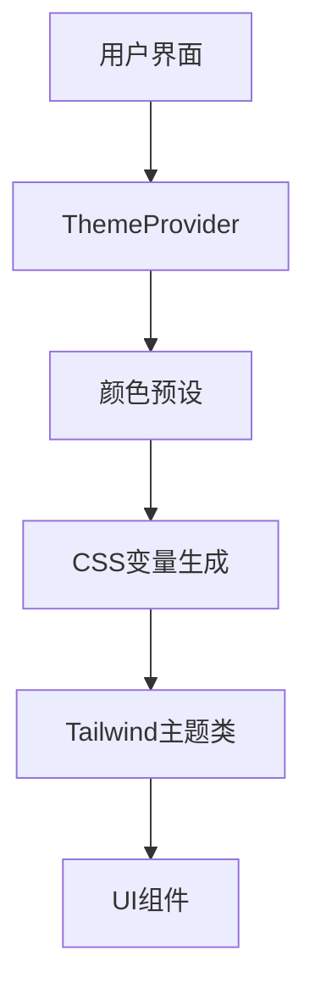

# UI Components 组件库文档

Research Navigator 的完整UI组件库，基于 shadcn/ui 构建，包含基础组件和定制组件。

## 📋 **基础组件 (shadcn/ui)**

### 🔘 **按钮和交互**
- **Button** - 各种样式和尺寸的按钮组件
  - 变体: `default` | `destructive` | `outline` | `secondary` | `ghost` | `link`
  - 尺寸: `sm` | `default` | `lg` | `icon`

### 📝 **表单组件**
- **Input** - 文本输入框
- **Textarea** - 多行文本输入
- **Label** - 表单标签
- **Checkbox** - 复选框
- **Switch** - 开关切换
- **Select** - 下拉选择器
- **Slider** - 滑动条
- **Form** - 表单容器和验证

### 🎨 **布局和容器**
- **Card** - 卡片容器 (`Card`, `CardHeader`, `CardTitle`, `CardDescription`, `CardContent`, `CardFooter`)
- **Separator** - 分隔线
- **ScrollArea** - 自定义滚动区域
- **Resizable** - 可调整大小的面板
- **Collapsible** - 可折叠容器

### 🗂️ **导航和选项卡**
- **Tabs** - 标签页组件
- **Accordion** - 手风琴折叠面板
- **DropdownMenu** - 下拉菜单

### 💬 **弹窗和提示**
- **Dialog** - 模态对话框
- **AlertDialog** - 确认对话框
- **Popover** - 弹出框
- **Tooltip** - 工具提示
- **Alert** - 警告提示框
- **Toaster** - Toast 通知

### 📊 **数据展示**
- **Table** - 数据表格
- **Badge** - 徽章标签
- **Progress** - 进度条
- **Skeleton** - 骨架屏加载

## 🎯 **定制组件 (Research Navigator)**

### 📈 **StatCard** - 统计卡片
```tsx
<StatCard 
  value="156" 
  label="收藏文献" 
  variant="primary" 
/>
```
- **用途**: 显示统计数据
- **变体**: `primary` | `success` | `warning` | `error` | `info` | `secondary`

### 🎴 **FeatureCard** - 功能卡片
```tsx
<FeatureCard
  title="文献搜索"
  description="搜索最新研究"
  icon={<Search />}
  variant="primary"
  onClick={() => navigate('/search')}
/>
```
- **用途**: 展示功能入口，支持点击交互
- **变体**: `primary` | `success` | `warning` | `error` | `info` | `secondary`

### 📅 **ActivityItem** - 活动时间线项目
```tsx
<ActivityItem
  title="添加了新文献"
  timestamp="2小时前"
  icon={<Plus />}
  variant="success"
/>
```
- **用途**: 时间线和活动记录展示
- **变体**: `primary` | `success` | `warning` | `error` | `info` | `secondary`

### 🎨 **ThemeShowcase** - 主题展示
```tsx
<ThemeShowcase />
```
- **用途**: 展示所有组件的主题化效果，用于开发和测试

## 🎨 **颜色设置系统**

Research Navigator 采用了先进的响应式颜色系统，支持实时主题切换和多种颜色预设。

### 🔧 **系统架构**



### 🎨 **颜色预设**
- **Blue (蓝色)**: 主要操作、信息提示 `#3b82f6`
- **Purple (紫色)**: 分析、洞察相关 `#8b5cf6`
- **Green (绿色)**: 成功状态、完成动作 `#10b981`
- **Orange (橙色)**: 警告、AI相关 `#f59e0b`
- **Red (红色)**: 错误、删除操作 `#ef4444`
- **Teal (青色)**: 数据、统计相关 `#14b8a6`
- **Pink (粉色)**: 收藏、重要标记 `#ec4899`
- **Indigo (靛蓝)**: 专业、企业级 `#6366f1`

### 🌓 **主题模式**
- **浅色模式**: 清爽简洁，适合日间使用
- **深色模式**: 护眼舒适，适合夜间使用
- **跟随系统**: 自动跟随操作系统设置

### 🎯 **智能色彩系统**

系统会自动为每个颜色预设生成完整的色彩变体：

```css
/* 主色调 */
--theme-primary: #3b82f6;
--theme-primary-fg: #ffffff;        /* 智能前景色 */
--theme-primary-soft: rgba(59,130,246,0.1);  /* 10%透明度 */

/* 语义色彩 */
--theme-success: #10b981;
--theme-warning: #f59e0b;
--theme-error: #ef4444;
--theme-info: #3b82f6;

/* 背景和文字 */
--theme-background: #ffffff;
--theme-text: #1f2937;
--theme-border: #e5e7eb;
```

### 💡 **使用方法**

#### 1. 在组件中使用主题类
```tsx
import { Button } from '@/components/ui/button';
import { Card } from '@/components/ui/card';

function MyComponent() {
  return (
    <Card className="bg-theme-background border-theme-border">
      <Button className="bg-theme-primary text-theme-primary-fg hover:bg-theme-primary/90">
        主色调按钮
      </Button>
      
      <div className="bg-theme-primary-soft text-theme-primary p-4 rounded-lg">
        柔和的主色调背景
      </div>
      
      <div className="text-theme-success">
        成功状态文字
      </div>
    </Card>
  );
}
```

#### 2. 访问主题上下文
```tsx
import { useSimplifiedTheme } from '@/providers/SimplifiedThemeProvider';

function ThemeAwareComponent() {
  const { theme, themeMode, setThemeMode, setColorPreset } = useSimplifiedTheme();
  
  return (
    <div>
      <p>当前主题: {theme.name}</p>
      <p>是否深色模式: {theme.isDark ? '是' : '否'}</p>
      
      <button onClick={() => setThemeMode('dark')}>
        切换到深色模式
      </button>
      
      <button onClick={() => setColorPreset('purple')}>
        使用紫色主题
      </button>
    </div>
  );
}
```

#### 3. 直接使用CSS变量
```css
.custom-component {
  background: var(--theme-primary);
  color: var(--theme-primary-fg);
  border: 1px solid var(--theme-border);
}

.custom-component:hover {
  background: var(--theme-primary-soft);
  color: var(--theme-primary);
}
```

### 🎨 **可用的主题类**

#### 背景色
- `bg-theme-background` - 主背景色
- `bg-theme-background-secondary` - 次级背景色
- `bg-theme-background-muted` - 静音背景色
- `bg-theme-primary` - 主色调背景
- `bg-theme-primary-soft` - 柔和主色调背景（10%透明度）

#### 文字色
- `text-theme-text` - 主文字色
- `text-theme-text-secondary` - 次级文字色
- `text-theme-text-muted` - 静音文字色
- `text-theme-primary` - 主色调文字
- `text-theme-primary-fg` - 主色调前景文字（用于主色调背景上）

#### 边框色
- `border-theme-border` - 主边框色
- `border-theme-border-secondary` - 次级边框色
- `border-theme-primary` - 主色调边框

#### 语义色彩
- `text-theme-success` / `bg-theme-success` - 成功状态
- `text-theme-warning` / `bg-theme-warning` - 警告状态
- `text-theme-error` / `bg-theme-error` - 错误状态
- `text-theme-info` / `bg-theme-info` - 信息状态

### 📱 **响应式设计**
所有主题类都支持响应式设计，使用 Tailwind CSS 的响应式前缀：
- `sm:` - 640px+
- `md:` - 768px+
- `lg:` - 1024px+
- `xl:` - 1280px+

```tsx
// 响应式主题类示例
<div className="bg-theme-background sm:bg-theme-primary md:bg-theme-success">
  响应式背景色
</div>
```

### 🛠️ **最佳实践**

#### 1. 优先使用主题类
```tsx
// ✅ 推荐 - 使用主题类
<Button className="bg-theme-primary text-theme-primary-fg">
  主要操作
</Button>

// ❌ 不推荐 - 硬编码颜色
<Button className="bg-blue-500 text-white">
  主要操作
</Button>
```

#### 2. 语义化颜色使用
```tsx
// ✅ 根据语义选择颜色
<div className="text-theme-success">保存成功</div>
<div className="text-theme-error">操作失败</div>
<div className="text-theme-warning">注意事项</div>

// ❌ 混淆语义
<div className="text-theme-error">保存成功</div>
```

#### 3. 柔和色彩的使用
```tsx
// ✅ 使用柔和色作为背景
<div className="bg-theme-primary-soft text-theme-primary p-4">
  重要提示区域
</div>

// ✅ 主色调作为强调
<Button className="bg-theme-primary text-theme-primary-fg">
  主要操作
</Button>
```

#### 4. 主题切换响应
```tsx
import { useSimplifiedTheme } from '@/providers/SimplifiedThemeProvider';

function AdaptiveComponent() {
  const { theme } = useSimplifiedTheme();
  
  return (
    <div className={`
      p-4 rounded-lg transition-colors duration-200
      ${theme.isDark 
        ? 'bg-theme-background-secondary' 
        : 'bg-theme-background'
      }
    `}>
      内容会根据主题自动调整
    </div>
  );
}
```

### 🎯 **高级用法**

#### 动态主题切换
```tsx
import { useSimplifiedTheme } from '@/providers/SimplifiedThemeProvider';

function ThemeController() {
  const { 
    themeMode, 
    setThemeMode, 
    setColorPreset, 
    availablePresets 
  } = useSimplifiedTheme();

  return (
    <div className="space-y-4">
      {/* 主题模式切换 */}
      <div className="flex gap-2">
        {['light', 'dark', 'system'].map(mode => (
          <button
            key={mode}
            onClick={() => setThemeMode(mode as any)}
            className={`
              px-4 py-2 rounded-lg transition-colors
              ${themeMode === mode 
                ? 'bg-theme-primary text-theme-primary-fg' 
                : 'bg-theme-background-secondary text-theme-text'
              }
            `}
          >
            {mode === 'light' ? '浅色' : mode === 'dark' ? '深色' : '跟随系统'}
          </button>
        ))}
      </div>

      {/* 颜色预设切换 */}
      <div className="grid grid-cols-4 gap-2">
        {availablePresets.map(preset => (
          <button
            key={preset.name}
            onClick={() => setColorPreset(preset.name)}
            className="p-3 rounded-lg border border-theme-border hover:bg-theme-background-secondary"
            title={preset.description}
          >
            <div 
              className="w-8 h-8 rounded-full mx-auto mb-2"
              style={{ backgroundColor: preset.colors.primary }}
            />
            <span className="text-xs text-theme-text-secondary">
              {preset.label}
            </span>
          </button>
        ))}
      </div>
    </div>
  );
}
```

### 🔧 **自定义CSS变量**

如果需要扩展主题系统，可以在组件中定义自定义CSS变量：

```tsx
function CustomComponent() {
  return (
    <div 
      className="p-4"
      style={{
        '--custom-accent': 'color-mix(in srgb, var(--theme-primary) 30%, var(--theme-background))',
        '--custom-shadow': '0 4px 6px -1px color-mix(in srgb, var(--theme-primary) 25%, transparent)'
      } as React.CSSProperties}
    >
      <div className="bg-[var(--custom-accent)] shadow-[var(--custom-shadow)]">
        自定义样式内容
      </div>
    </div>
  );
}
```

### 🚀 **性能优化**

1. **CSS变量缓存**: 主题变量会被缓存，避免重复计算
2. **批量更新**: 主题切换时会批量更新所有CSS变量
3. **选择器优化**: 使用高效的CSS选择器避免重绘
4. **懒加载**: 预设数据按需加载

### 📋 **故障排除**

#### 主题类不生效？
1. 确保已正确包装 `SimplifiedThemeProvider`
2. 检查 Tailwind CSS 配置是否包含主题类
3. 验证CSS变量是否正确注入到DOM

#### 颜色不一致？
1. 确保使用的是主题类而不是硬编码颜色
2. 检查是否在正确的主题上下文中
3. 验证颜色预设配置是否正确

## 🛠️ **主题工具类**

除了预设的组件，我们还提供了一系列主题工具类，方便开发者创建自定义组件：

### 🎨 **颜色变体类**

```tsx
import { 
  textVariants, 
  backgroundVariants, 
  borderVariants, 
  iconContainerVariants,
  statusVariants 
} from '@/components/ui';

// 使用文字颜色变体
<span className={textVariants({ variant: "success" })}>
  成功消息
</span>

// 使用背景颜色变体
<div className={backgroundVariants({ variant: "primary-soft" })}>
  柔和背景
</div>

// 使用图标容器变体
<div className={iconContainerVariants({ variant: "warning", size: "lg" })}>
  <AlertTriangle className="h-5 w-5" />
</div>

// 使用状态指示器变体
<div className={statusVariants({ variant: "active" })}>
  <div className="w-2 h-2 rounded-full bg-current" />
  活跃状态
</div>
```

### 🧩 **可用变体**

所有工具类都支持以下语义化变体：
- `primary` - 主色调
- `success` - 成功状态 
- `warning` - 警告状态
- `error` - 错误状态
- `info` - 信息状态
- `secondary` - 次要状态

### 🔧 **组合变体**

```tsx
import { cardVariants, inputVariants } from '@/components/ui';

// 自定义卡片
<div className={cardVariants({ variant: "primary" })}>
  主色调卡片
</div>

// 自定义输入框
<input className={inputVariants({ variant: "error", size: "lg" })} />
```

---

## 🧩 **组件库**

## 📱 **使用示例**

```tsx
import { 
  Button, 
  Card, 
  CardContent,
  StatCard,
  FeatureCard 
} from '@/components/ui';

function ExamplePage() {
  return (
    <div className="space-y-6">
      <Card>
        <CardContent className="p-6">
          <div className="grid grid-cols-2 md:grid-cols-4 gap-4">
            <StatCard value="156" label="文献" color="blue" />
            <StatCard value="8" label="项目" color="green" />
          </div>
        </CardContent>
      </Card>
      
      <div className="grid grid-cols-1 md:grid-cols-2 lg:grid-cols-4 gap-4">
        <FeatureCard
          title="搜索"
          description="查找文献"
          icon={<Search />}
          iconColor="blue"
          onClick={() => console.log('搜索')}
        />
      </div>
    </div>
  );
}
```

## 🔧 **开发指南**

### 添加新组件
1. 在 `src/components/ui/` 创建组件文件
2. 在 `index.ts` 中导出
3. 遵循现有的设计模式和命名约定

### 样式约定
- 使用 Tailwind CSS 类名
- 支持 `className` prop 进行样式覆盖
- 使用 `cn()` 工具函数合并类名
- 支持深色模式 (`dark:` 前缀)

### TypeScript 类型
- 所有组件都有完整的 TypeScript 类型定义
- 导出必要的类型接口供外部使用
